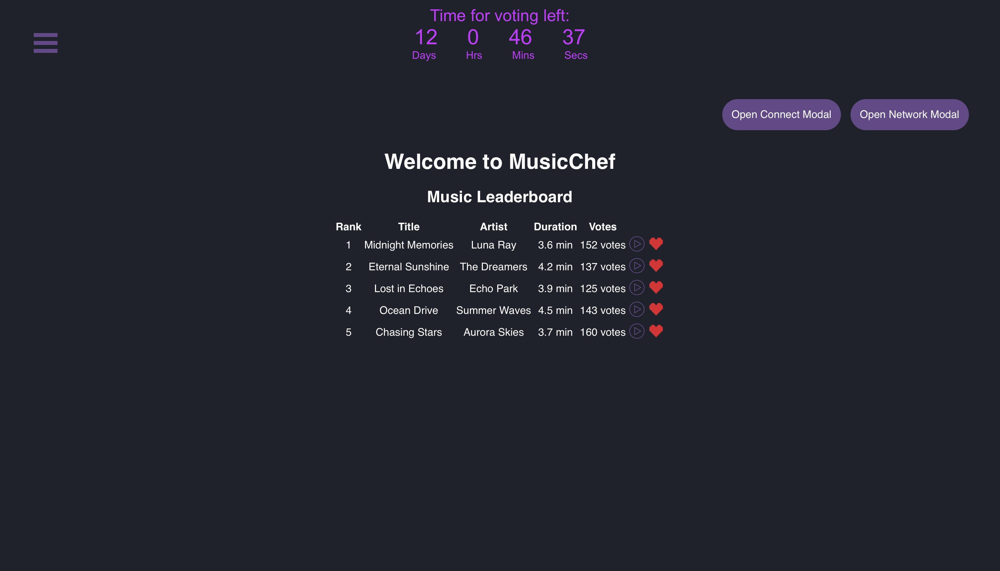
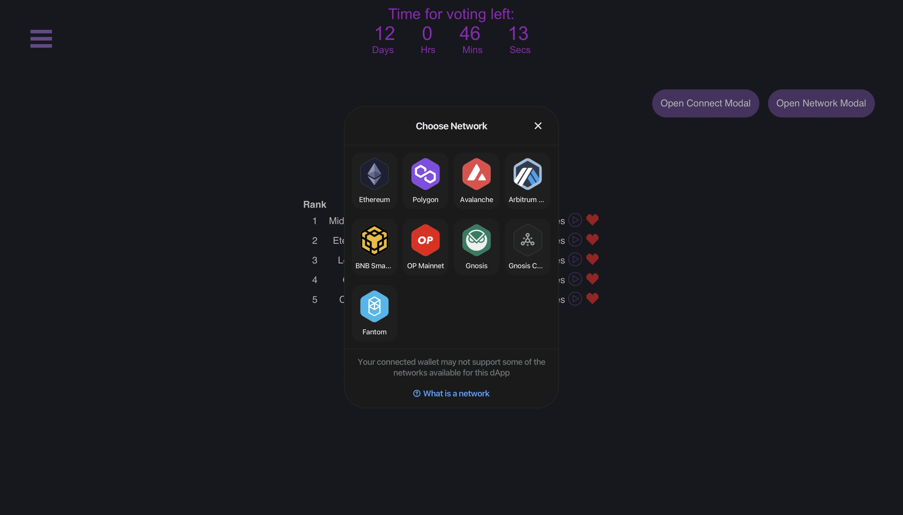

# Music Chef

Music Chef is a DAO platform, designed for AI-generated music. It allows artists to upload AI-generated tracks. Tracks that garner enough community support are published on digital music services like Spotify, and the artist is rewarded with an NFT certifying ownership.
## Description
Music Chef is an DAO platform is specifically designed for the AI-generated music sector. It integrates the secure and transparent nature of blockchain with a community-driven governance model, creating a unique ecosystem for music creation, listening and sharing.

At the heart of the platform is the $CHEF token, which is used for various activities like uploading music, voting on tracks, and distributing rewards. This token economy encourages active participation and fair reward distribution. Artists can upload their AI-generated tracks by locking in a certain amount of these tokens, a mechanism designed to ensure serious submissions and prevent spam. The community plays a vital role in curating the music through a democratic voting process, determining which tracks resonate most with the audience.

Tracks that successfully garner community support are not only published on major digital music services but also earn the artist an NFT, providing proof of ownership and a portion of the bounty in $CHEF tokens. Conversely, tracks deemed low-quality or spam are removed, with the locked tokens forfeited to the DAO treasury, thereby upholding the quality of content on the platform.

A notable feature of the platform is its reward system for voters. Those who support successful projects receive a share of the revenue generated from music platforms, incentivizing early and meaningful participation in the music curation process. This aligns the interests of both artists and listeners, creating a symbiotic relationship.

Furthermore, the platform serves as a feedback loop for AI improvement in music. User preferences and reactions to different tracks provide invaluable data, enabling continuous refinement of AI music generation tools.

Smart contracts govern all critical functions, ensuring transparency and protection against vulnerabilities. Regular audits and security measures are in place to maintain the integrity of the platform and its token economy.

In conclusion, Music Chef project stands as fusion of AI, blockchain, and music, addressing the challenges of quality control and monetization in AI-generated music. It empowers artists, engages listeners, and leads the way in innovative applications of AI and blockchain in creative industries.

## Tools Used
- React and JavaScript (Frontend): React is a popular JavaScript library for building user interfaces, particularly single-page applications. It's known for its efficiency and flexibility. Using React for our frontend means our application is dynamic, responsive, and capable of handling complex user interactions efficiently.

- Blockchain (Backend): We have deployed our backend across multiple blockchain networks, including Gnosis, Base, Scroll. Our test deployments were done with the Remix IDE.

- IPFS for Music Data Storage: The InterPlanetary File System (IPFS) is a protocol and peer-to-peer network for storing and sharing data in a distributed file system. Using IPFS for storing music data ensures decentralization, redundancy, and efficiency in data retrieval.
OpenZeppelin Library: This is a library for secure smart contract development. It provides reusable components to build custom smart contracts and decentralized applications on the Ethereum network. The use of OpenZeppelin did helped in creating secure, standard-compliant smart contracts for your DAO and tokenomics.

- Custom DAO and Tokenomics Solution: Developing a custom solution for our decentralized autonomous organization (DAO) and tokenomics made possible a high level of customization and innovation. This involved unique governance mechanisms, token distribution strategies, and incentivization models tailored to our project's needs.

